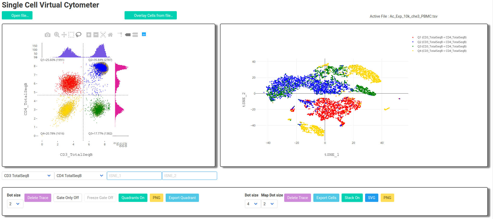
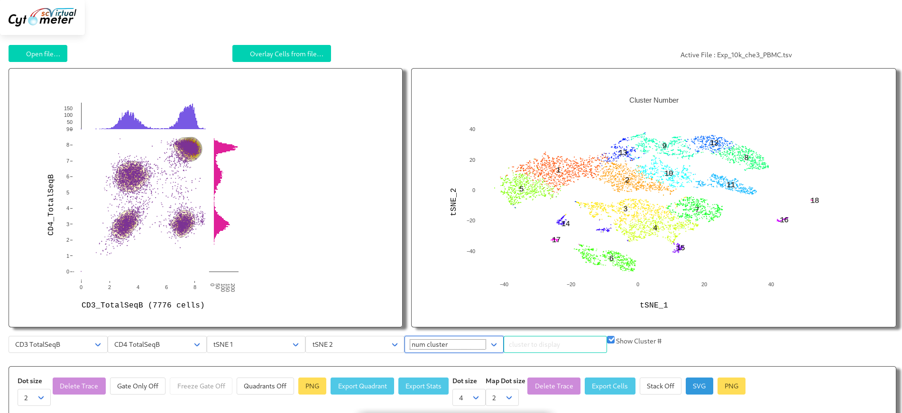
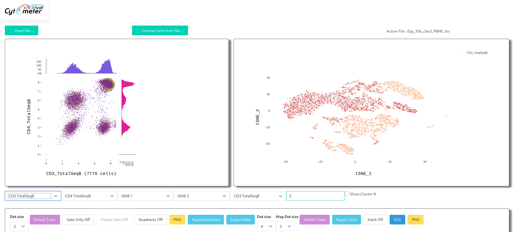

<h1>

Single-Cell  Virtual  Cytometer
 
 

</h1>

*Single-Cell  Virtual  Cytometer* is an  open  source software for straightforward visualization and exploration of multimodal  single  cell  datasets  as  in  flow  cytometry. Single-Cell  Virtual  Cytometer  is compatible with 
[Single-Cell Signature Explorer](https://doi.org/10.1093/nar/gkz601) available 
[here.](https://sites.google.com/site/fredsoftwares/products/single-cell-signature-explorer)

For more details see the <b><a href="./doc/Manual.pdf" target="_blank">Manual</a></b>
inside doc folder

 

## ScreenShots

Single-Cell Virtual  Cytometer can display clusters :

Single-Cell Virtual  Cytometer can display genes and antibodies. But for high qualities pictures, we recommend [Single-Cell Signature Explorer](https://doi.org/10.1093/nar/gkz601) available 
[here.](https://sites.google.com/site/fredsoftwares/products/single-cell-signature-explorer)

 Single-Cell Virtual  Cytometer is written in 
  
  with the libraries 
 

statically linked. So it can be used directly off line on a web browser and installation is immediate.
